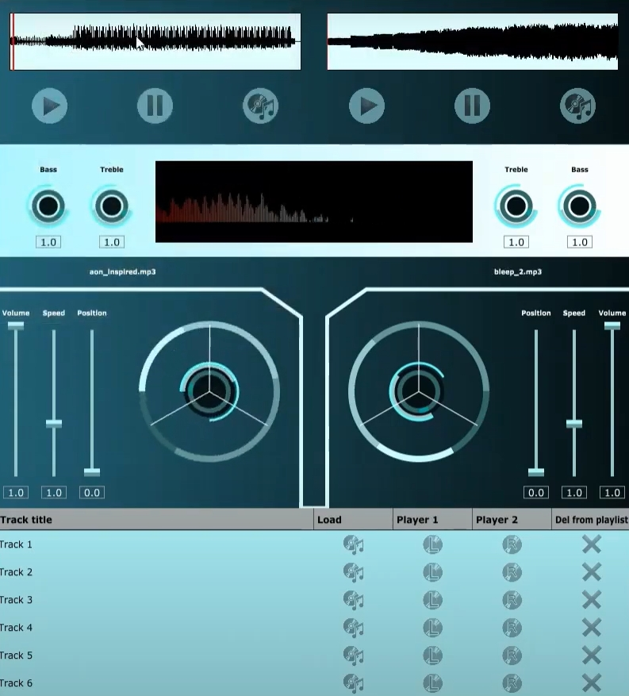

## Summary

The application enables users to load, play, mix, and manipulate two audio tracks simultaneously. In addition to these features, it includes a custom “Tron”-inspired user interface, adjustable bass and treble controls, a visual frequency analyser, a realistic turntable scratching effect, and a playlist management system. Together, these elements combine to deliver a complete and immersive DJ experience.

## Video Link Below:
https://youtu.be/IifzSzUEb-E

  

  The DJ App has a "Tron-Inspired" Layout.

## Breakdown Of Features

### Audio Loading and Playback

To enable audio playback, three core classes were created: the MainComponent, DJAudioPlayer, and DeckGUI. Each DeckGUI instance, representing the left and right players, allows users to load tracks via a dedicated Load button. When the button is clicked, the file’s URL is sent to the DJAudioPlayer::loadURL() function, which generates an input stream that is passed to the transport source for playback. The application also supports drag-and-drop functionality through the isInterestedInFileDrag() and filesDropped() functions in the DeckGUI class, which handle file detection and loading directly into the player interface.

Each player includes a Play button, which is connected to a button::listener in DeckGUI. When pressed, the listener triggers the start() function within the DJAudioPlayer class, which activates playback on the transport source. The two tracks are then mixed together using JUCE’s MixerAudioSource class, allowing both decks to play and blend audio simultaneously.

Volume control for each deck is implemented through a volume slider, or volSlider, which notifies the sliderValueChanged() function whenever it is adjusted. This function calls DJAudioPlayer::setGain() with the new value, dynamically altering the gain on the transport source and adjusting the deck’s volume output in real time.

Playback position and speed can also be modified through two additional sliders. The position slider controls playback location by calling setPosition() on the transport source, while the speed slider modifies playback tempo by calling setResamplingRatio() on the resample source. These controls allow users to fine-tune playback and synchronization between tracks.

### Playlist and Waveform Display

The playlist feature was implemented using JUCE’s TableListBox class, providing a structured interface for track management. Within the PlaylistComponent, the functions getNumRows(), paintRowBackground(), and paintCell() handle table layout and rendering. A Load button was added to each row through refreshComponentForCell(), though at this initial stage it was primarily focused on design and placement, with functionality expanded later in development.

A waveform display was also implemented to give users a visual representation of each track. This feature uses JUCE’s AudioThumbnail class, referred to as audioThumb, which processes the audio file data into a scaled-down waveform. Once loaded, the waveform is drawn using the drawChannel() function within the component’s paint method, providing a visual indication of the track’s structure and amplitude.

### User Interface and Visual Design

The visual design of the project was heavily inspired by the film Tron: Legacy, particularly the Daft Punk DJ scene. The goal was to capture the futuristic, neon-lit aesthetic associated with the film’s digital world. To achieve this, the user interface employs gradients of cool blue tones, glowing accents, and symmetrical arrangements.

Two new classes were created to manage the project’s visual design: BackgroundGraphics and OtherLookAndFeel. The BackgroundGraphics class manages the visual layout above the playlist component, using horizontal colour gradients that fade from dark to light blue to create depth and vibrancy. White Path lines were added to separate different sections of the interface, reinforcing the “Tron” aesthetic. To ensure visual balance, mirrored symmetry was introduced in DeckGUI::resized(), where conditional statements adjust component positions to maintain a consistent layout across both decks.

The OtherLookAndFeel class is responsible for customizing the appearance of interface components. Linear sliders were redesigned with light blue rectangular tracks and small thumb indicators that move along the track during interaction. Rotary sliders were drawn using concentric arcs through the addCentredArc function, giving them a dial-like appearance. These visual updates were combined with descriptive labels added via a new setSliderStyles() function in DeckGUI, improving usability and presentation.

Buttons within the interface, including Load, Play, Pause, and Delete, were redesigned as ImageButtons that highlight when hovered over, providing dynamic feedback to user interaction. The PlaylistComponent and WaveformDisplay were also refined with complementary colour schemes to maintain consistency across the interface. The design choices and methods were influenced by tutorials from the JUCE documentation and community resources.

### Audio Effects and Filtering

In addition to playback and mixing controls, two new rotary sliders were introduced to control bass and treble levels. These use JUCE’s IIRFilterAudioSource class, integrated into the DJAudioPlayer. Two new functions, setBass() and setTreble(), were created to manage these filters. Slider listeners in DeckGUI detect when the bass or treble sliders are adjusted and call these functions to modify the amplitude of the relevant frequency bands. The rotary sliders are visually represented by rotating arcs created in the OtherLookAndFeel class, giving users feedback as they adjust tonal balance.

### Advanced Features

To further enhance the realism of the application, a **Turntable class** was developed to simulate vinyl scratching. When playback begins, the turntable graphic spins to mimic a real record in motion. This rotation stops when the Pause button is pressed, managed through a flag system linked to the DeckGUI’s play and pause button states. The scratching functionality was implemented using an invisible rotary slider fixed at a value of 1.5. Moving the slider left decreases the value to 1, shifting playback slightly backward, while moving it right increases it to 2, shifting playback forward. After each scratch action, the slider automatically resets to its neutral 1.5 position for smoother control. This interaction also affects the Turntable class’s pushRecordForward and pushRecordBackward booleans, which visually animate the record’s movement through the Turntable::timerCallback() function.

Another major addition was the **Frequency Visualiser**, created using JUCE’s Fast Fourier Transform (FFT) module from the DSP library. The visualiser analyses the incoming audio signal and displays the amplitude spectrum across the frequency range. Based on JUCE’s Spectrum Analyser tutorial, the implementation was adapted to replace the default jagged-line style with smoother vertical bars, each representing different frequencies. These bars use colour gradients that correspond to amplitude, resulting in a vibrant and dynamic visualization that reacts in real time to changes in bass and treble levels.

The **PlaylistComponent** was also significantly developed beyond its initial implementation. Each row in the playlist now includes buttons to load a track, send it to Player 1 or Player 2, and delete it. A new TrackLibrary class was created to store track data, including the file name, URL, and a boolean variable indicating whether the track is currently loaded. When a load button is pressed, the application uses the FileBrowserComponent and launchAsync() to select a file and store its data in the TrackLibrary. The “Load to Player” buttons send the selected track’s URL to the DeckGUI::loadFileToDeck() function, which then passes it to DJAudioPlayer::loadURL(). The delete button resets the track’s information in the TrackLibrary, removing it from the playlist.

### References

JUCE Documentation – https://docs.juce.com/

JUCE Look and Feel Customisation Tutorial – https://docs.juce.com/master/tutorial_look_and_feel_customisation.html

JUCE Spectrum Analyser Tutorial – https://docs.juce.com/master/tutorial_spectrum_analyser.html

JUCE Image Buttons Tutorial – https://www.youtube.com/watch?v=g_6UKygCp-0&t=14s

VirtualDJ – https://www.virtualdj.com/

Tron: Legacy (2010) – Visual and thematic inspiration
